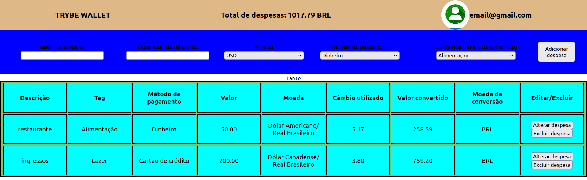

# Trybe Wallet
Neste projeto eu desenvolvi uma carteira de controle de gastos com conversor de moedas, ao utilizar essa aplicação um usuário é capaz de; Adicionar, remover e editar um gasto; Visualizar uma tabelas com seus gastos; Visualizar o total de gastos convertidos para uma moeda de escolha. Durante o desenvolvimento da aplicação, eu pude colocar em prática habilidades como:
  * Criar um store Redux em aplicações React
  * Criar reducers no Redux em aplicações React
  * Criar actions no Redux em aplicações React
  * Criar dispatchers no Redux em aplicações React
  * Conectar Redux aos componentes React
  * Criar actions assíncronas na sua aplicação React que faz uso de Redux.


<div align="center">
    
</div>

## Como executar

**1. Clone o repositório**

```shell
    git clone git@github.com:CalebeLAR/trybe_wallet.git
```

**2. Instale as dependências**

```shell
    npm install
```

**3. Rode a aplicação no navegador**

```shell
    npm start
```

**4. Rode os testes de integração**

```shell
    npm run test
```
**5. Veja a cobertura dos testes integração**  

```shell
    npm run test-coverage
```
    O comando para ver a cobertura de testes gera automaticamente a pasta coverage
    na raiz do projeto, nela há um arquivo index.html localizado em lcov-report que
    apresenta melhor as informações exibidas no terminal após executar o comando.


> _Sexto projeto desenvolvido no módulo de Front-End durante minha formação na escola de tecnologia da Trybe, que elaborou os requisitos do projeto._